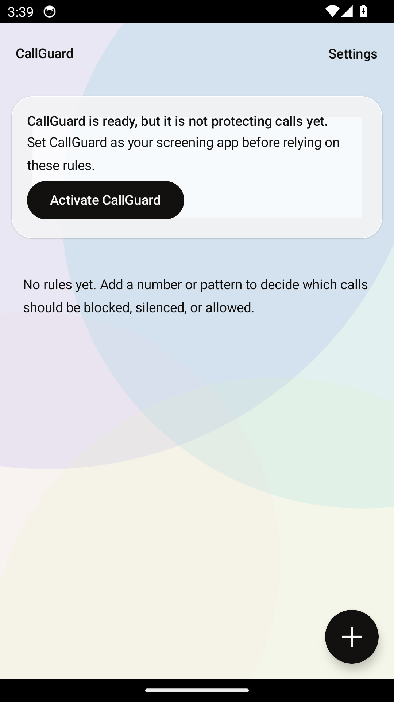
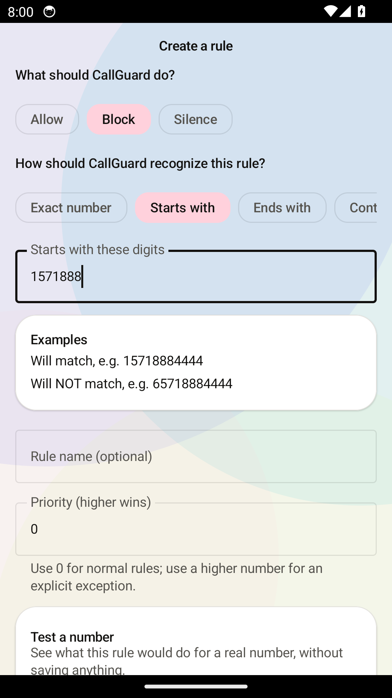
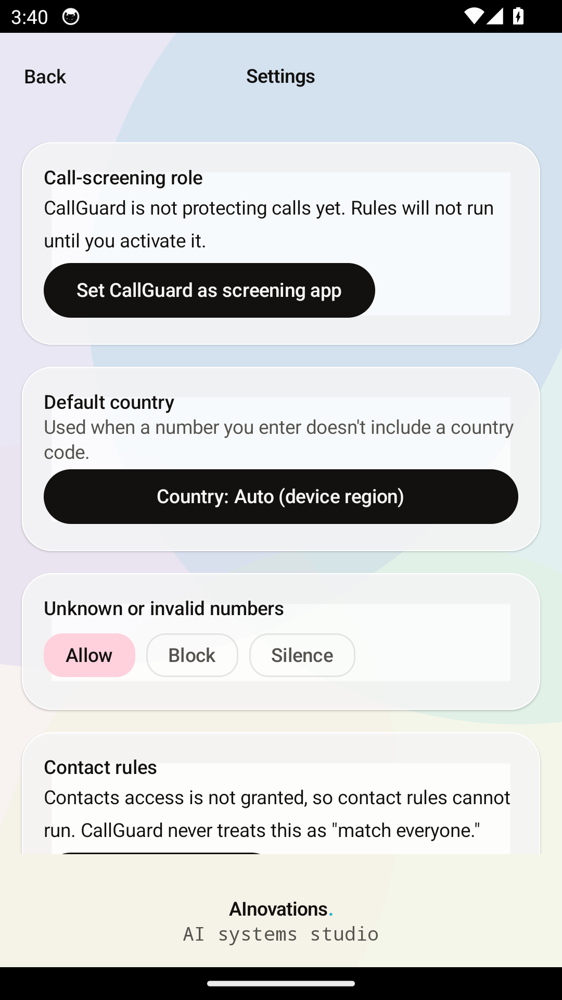
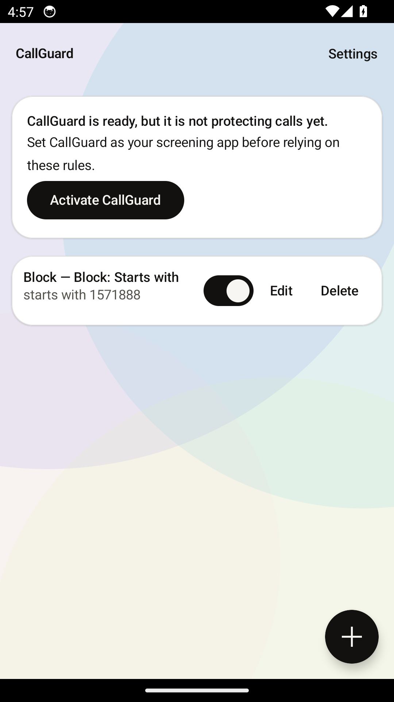

# CallGuard

### Proof-shaped call control for Android

CallGuard is an offline-first, privacy-minded call-screening app from
[AInovations](https://ainovations.studio). It turns plain-language rules into
predictable cellular-call decisions — without an account, ad network, or cloud
backend.

> **Early release:** CallGuard is under active development. Review the source,
> run the gates, and treat pre-release APKs as testing builds.

[-3ddc84?logo=android&logoColor=white)](https://developer.android.com/)
[](#distribution)

## Why CallGuard

Most call blockers hide a complicated rule engine behind a single switch.
CallGuard makes the decision visible:

- **Exact number, starts with, ends with, contains, regex, contacts, and
  specific-number rules**
- **Country-aware normalization** for international and national formats
- **Explicit block/allow behavior** with a configurable fallback for unknown
  or invalid caller IDs
- **Offline Android storage** using Room and DataStore
- **System-owned call screening** through Android's `CallScreeningService`
- **Readable explanations** so a rule is something you can inspect, not a
  mystery toggle

The visual language follows AInovations' light canvas, dark ink, and restrained
iridescent accent: calm enough for a utility, distinctive enough to feel
intentional.

The MVP includes a guided Compose rule editor, country-aware normalization,
Room persistence, and an Android `CallScreeningService`. Screening is inactive
until the user selects CallGuard as the system call-screening app. Contact
matching is optional and requires an explicit contacts permission grant. Blocked
calls remain in the system call log; CallGuard skips the blocked-call
notification but does not hide evidence from the user.

## Reproducible container build

The primary build path is a container with a pinned JDK 17 and the pinned
Android SDK platform/build-tools. No host Java, Gradle, or Android SDK is
required. The source tree is mounted at `/workspace`; Gradle caches live in a
named volume. No host credentials are copied into the image. Podman is the
tested engine (rootless, non-root `developer` user via `--userns=keep-id`);
Docker is supported best-effort via engine gating in the scripts
(`CONTAINER_ENGINE=podman|docker` to override). Instrumentation additionally
requires a working `/dev/kvm` device; the non-emulator gate does not.

Build the debug APK:

```bash
./scripts/container-build.sh
```

Expected: `app/build/outputs/apk/debug/app-debug.apk` is produced and the
command exits 0.

Run the deterministic local gate (formatting, lint, unit tests, and manifest
audit):

```bash
./scripts/container-test.sh
```

Run Compose and service contract tests on the pinned API-34 emulator:

```bash
./scripts/container-test.sh --instrumentation
```

Capture emulator GUI screenshots:

```bash
./scripts/capture-screenshots.sh
```

The emulator is created inside the container and uses `/dev/kvm` when
available. Instrumentation is a hard failure when the emulator cannot boot; it
is never silently skipped.

Check dependency integrity directly:

```bash
./scripts/verify-dependencies.sh
```

Build and verify the unsigned release candidate:

```bash
./scripts/container-release.sh   # clean assembleRelease + inline APK verification
./scripts/verify-apk.sh          # re-check the release artifact (optional)
```

`container-release.sh` produces and verifies
`app/build/outputs/apk/release/app-release-unsigned.apk` in one container
invocation. The release build type has no configured `signingConfig`, so this
artifact is always unsigned; it is meant for identity/manifest verification
and manual test-device installs, not distribution. `verify-apk.sh` fails
closed if the applicationId, version name/code, merged permission set
(including AGP's synthetic receiver permission), debuggable flag, or APK
structure don't match this release candidate. Debug APKs are rejected.

### CI versus the local/pre-release gates

The GitHub Actions workflow (`.github/workflows/build.yml`) runs the
container-gate on every push and pull request: formatting, lint, unit tests,
manifest audit, and a debug assemble (`container-test.sh` and
`container-build.sh`). It deliberately does **not** run instrumentation or the
release build in CI, because GitHub-hosted runners don't reliably expose
`/dev/kvm`, and an emulator without hardware acceleration is a flaky hang, not
a gate. `container-test.sh --instrumentation` and `container-release.sh` +
`verify-apk.sh` are **required pre-release checks** that the release owner
runs locally (or on a runner with confirmed, reliable KVM) before tagging a
release — they are not implied to run on every CI job.

On Android, open CallGuard settings and tap **Set CallGuard as screening app**.
The system role dialog is authoritative; CallGuard never claims the role is
active based only on the user's intent. Unknown or unparseable caller IDs use
the configured fallback action, which defaults to allow.

## Toolchain pins

| Component | Version |
|---|---|
| JDK | 17 (eclipse-temurin) |
| Gradle | 8.7 (wrapper) |
| Android Gradle Plugin | 8.5.2 |
| Kotlin | 2.0.20 |
| Compose BOM | 2024.09.02 |
| Android platform | android-34 |
| Build tools | 34.0.0 |
| minSdk / targetSdk / compileSdk | 26 / 34 / 34 |

All plugin and library versions live in `gradle/libs.versions.toml`.
Dependency locking is enabled in strict mode (`dependencyLocking` with
`lockMode = LockMode.STRICT` in `app/build.gradle.kts`); the lockfiles
(`app/gradle.lockfile`, `settings-gradle.lockfile`) are committed and cover
both the debug and release resolution graphs — `app/gradle.lockfile` locks
`releaseCompileClasspath`/`releaseRuntimeClasspath` as well as their debug
counterparts, so `container-release.sh` resolves against the same locked,
verified dependency set as the debug gate, not a separately-trusted one.
Dependency verification is enforced at build time via the
`--dependency-verification strict` flag passed by every script that invokes
Gradle, backed by the committed `gradle/verification-metadata.xml` (sha-256).
`verify-dependencies.sh` and CI exercise this for the debug variant; the
release variant gets the same strict verification when `container-release.sh`
runs, since the flag applies to the whole Gradle invocation, not one task. A
fresh container build is dependency-locked and integrity-checked; the project
does not claim byte-for-byte reproducibility of every Android tool output. The
base image is pinned by immutable digest and the Android command-line tools
archive is checked against Google's published sha-1 and size before install.

## Project layout

```
settings.gradle.kts        # project + repository settings
build.gradle.kts           # top-level plugin declarations
gradle/libs.versions.toml  # version catalog
app/                       # application module (namespace studio.ainovations.callguard)
Containerfile              # pinned, integrity-checked build image
.devcontainer/             # VS Code dev container
scripts/                   # build, tests, emulator, release, manifest, and dependency gates
docs/screenshots/          # emulator-captured GUI snapshots
metadata/                  # F-Droid release-candidate metadata (prepared, not submitted)
NOTICE                     # third-party attribution for bundled dependencies
```

## Trust model and important limits

CallGuard is intentionally narrow:

- It screens **cellular calls**, not SMS or messaging-app traffic. SMS support
  would require a separate default-SMS-app implementation and is not silently
  implied.
- Android must designate CallGuard as the active call-screening app. The
  Settings screen reports the system role rather than assuming it was granted.
- The APK install floor is API 26, but active call screening requires Android
  10/API 29 or newer. Older devices can inspect the interface but cannot use
  the screening role.
- Contact rules require the user to grant `READ_CONTACTS`. If that permission
  is absent or contact data cannot be loaded, CallGuard follows the configured
  fallback instead of pretending contact matching succeeded.
- Blocked calls remain visible in the system call log. CallGuard suppresses the
  blocked-call notification; it does not erase evidence or promise carrier-level
  blocking.
- Screening is local. No phone numbers, contacts, or rules are sent to a
  remote service.

These constraints are part of the product contract, not footnotes. They are
also covered by tests and visible UI warnings where they affect a decision.

## Screens

| Rules | Create a rule | Settings |
|---|---|---|
|  |  |  |

Populated rule-list state:



## Distribution

The intended release path is:

1. Source review and deterministic container gates
2. Signed test build and device verification
3. F-Droid metadata and reproducible-build review
4. Public release under the Apache-2.0 FOSS license

CallGuard is **not yet listed on F-Droid**. Do not mistake a GitHub Actions
build badge or a locally produced APK for an F-Droid release. The first public
release will include this Apache-2.0 license, source-build instructions,
metadata, and release provenance required by the selected distribution channel.

F-Droid metadata for this release candidate is **prepared, not submitted**:
`metadata/studio.ainovations.callguard.yml` declares the Apache-2.0 license,
public source/issue-tracker URLs, and non-sensitive build instructions, but
its `commit` field is an explicit placeholder rather than a real commit —
F-Droid's build tooling needs an immutable reference to the exact reviewed
source, which doesn't exist until this branch is merged and tagged. No file
in this repository submits, requests, or implies submission to F-Droid; that
remains a separate release-owner step once the placeholder is replaced with
a real tag or commit.

## Development principles

CallGuard is built around a simple promise: **make the decision inspectable**.
That means:

- deterministic tests for rule semantics and normalization edge cases;
- explicit negative tests for malformed, disabled, or unavailable inputs;
- dependency locks and artifact verification in the container build;
- emulator-backed UI and service contract tests;
- no analytics, no account requirement, and no network dependency in the
  screening path.

Automated checks are evidence, not a substitute for source inspection and human
release judgment. Every release decision remains reviewable from the source,
tests, and build artifacts.

## Contributing

The project is licensed under Apache-2.0. Contribution guidance, a security
contact, and a release policy will be expanded before the first stable release.
Until then, issue reports and review notes are welcome, but pre-release builds
may change without compatibility guarantees.

## Project

CallGuard is an AInovations project:

- Studio: [ainovations.studio](https://ainovations.studio)
- Repository: [AInovationsStudio/callguard](https://github.com/AInovationsStudio/callguard)
- Package: `studio.ainovations.callguard`
